# 25 RAG Types: Comprehensive Guide

This document provides a detailed overview of 25 different Retrieval-Augmented Generation (RAG) approaches, their characteristics, and implementation patterns.

## Table of Contents

1. [Standard RAG](#1-standard-rag)
2. [Corrective RAG](#2-corrective-rag)
3. [Speculative RAG](#3-speculative-rag)
4. [Fusion RAG](#4-fusion-rag)
5. [Agentic RAG](#5-agentic-rag)
6. [Self RAG](#6-self-rag)
7. [Adaptive RAG](#7-adaptive-rag)
8. [REFEED Retrieval Feedback](#8-refeed-retrieval-feedback)
9. [REALM](#9-realm)
10. [RAPTOR - Tree-Organized Retrieval](#10-raptor---tree-organized-retrieval)
11. [REVEAL for Visual-Language Model](#11-reveal-for-visual-language-model)
12. [REACT](#12-react)
13. [REPLUG Retrieval Plugin](#13-replug-retrieval-plugin)
14. [MEMO RAG](#14-memo-rag)
15. [Attention-based RAG (ATLAS)](#15-attention-based-rag-atlas)
16. [RETRO](#16-retro)
17. [AUTO RAG](#17-auto-rag)
18. [CORAG: Cost-Constrained RAG](#18-corag-cost-constrained-rag)
19. [EACO-RAG](#19-eaco-rag)
20. [RULE RAG](#20-rule-rag)
21. [Conversational RAG (CORAL)](#21-conversational-rag-coral)
22. [Iterative RAG](#22-iterative-rag)
23. [Context-driven Tree-structured Retrieval (ConTReGen)](#23-context-driven-tree-structured-retrieval-contregen)
24. [Causality-Enhanced Reflective and Retrieval-Augmented Translation (CRAT)](#24-causality-enhanced-reflective-and-retrieval-augmented-translation-crat)
25. [Graph RAG](#25-graph-rag)

---

## 1. Standard RAG

**Description**: The foundational RAG approach that combines retrieval with large language models for accurate, context-aware responses.

**Key Features**:
- Combines retrieval with large language models for accurate, context-aware responses
- Breaks documents into chunks for efficient information retrieval
- Aims for 1-2 second response times for real-time use
- Enhances answer quality by leveraging external data sources

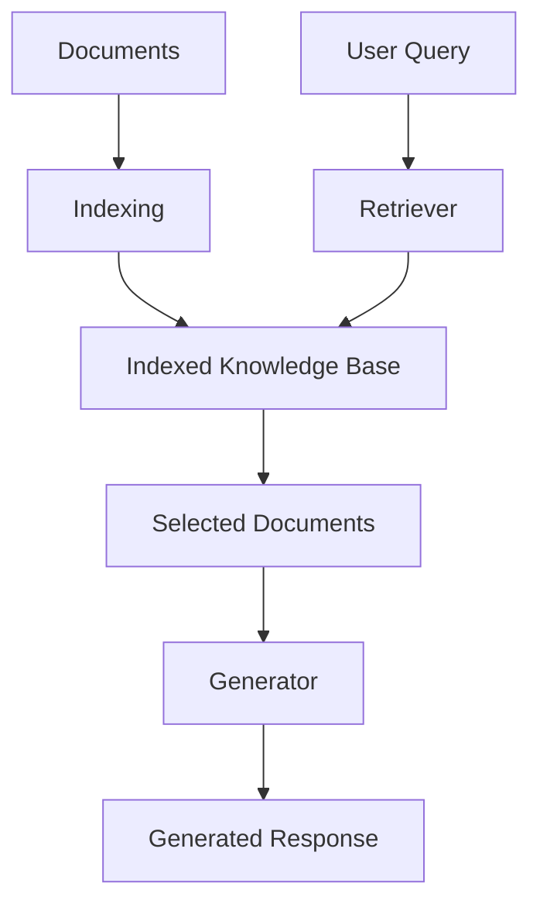

---

## 2. Corrective RAG

**Description**: An enhanced RAG system that focuses on identifying and fixing errors in generated responses through feedback loops.

**Key Features**:
- Focuses on identifying and fixing errors in generated responses
- Uses multiple passes to improve outputs based on feedback
- Aims for higher precision and user satisfaction compared to standard RAG
- Leverages user feedback to enhance the correction process

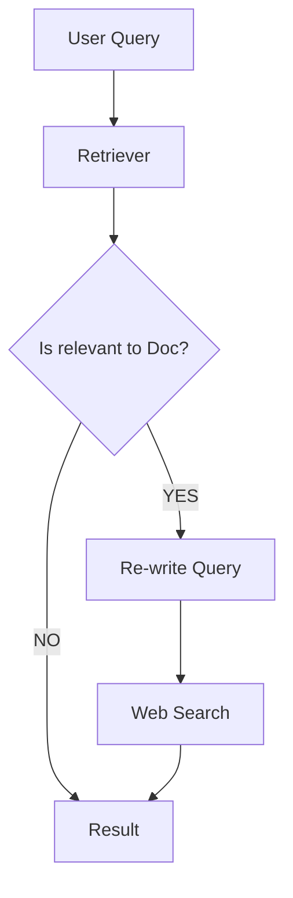

---

## 3. Speculative RAG

**Description**: Uses a dual-model approach with a small specialist model for drafting and a larger generalist model for verification.

**Key Features**:
- Uses a small specialist model for drafting and a larger generalist model for verification
- Parallel Drafting: Speeds up responses by generating multiple drafts simultaneously
- Superior Accuracy: Outperforms standard RAG systems
- Efficient Processing: Offloads complex tasks to specialized models, reducing computational load

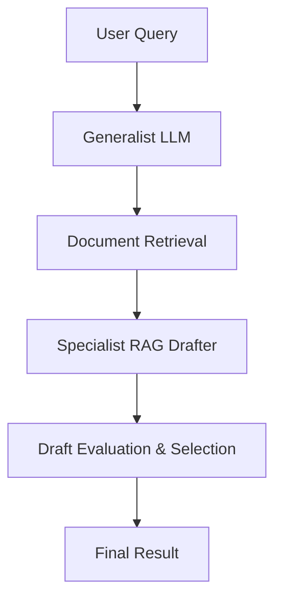

---

## 4. Fusion RAG

**Description**: Integrates multiple retrieval methods and data sources for enhanced response quality and system resilience.

**Key Features**:
- Integrates multiple retrieval methods and data sources for enhanced response quality
- Provides comprehensive answers by leveraging diverse data inputs
- Increases system resilience by reducing dependence on a single source
- Adapts retrieval strategies dynamically based on query context

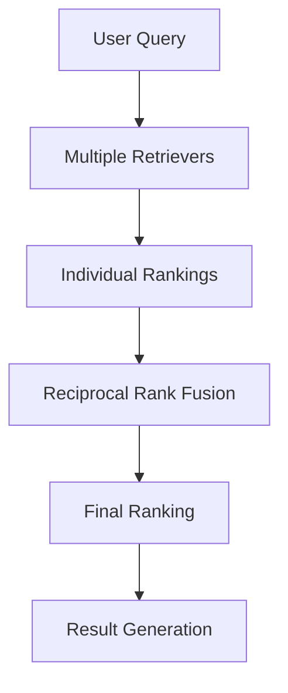

---

## 5. Agentic RAG

**Description**: Uses adaptive agents for real-time strategy adjustments in information retrieval with modular design.

**Key Features**:
- Uses adaptive agents for real-time strategy adjustments in information retrieval
- Accurately interprets user intent for relevant, trustworthy responses
- Modular design enables easy integration of new data sources and features
- Enhances parallel processing and performance on complex tasks by running agents concurrently

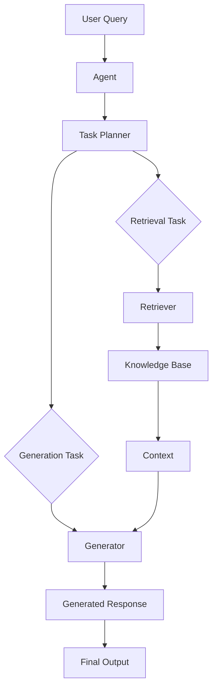

---

## 6. Self RAG

**Description**: Uses the model's own outputs as retrieval candidates for better contextual relevance and iterative refinement.

**Key Features**:
- Uses the model's own outputs as retrieval candidates for better contextual relevance
- Refines responses iteratively, improving consistency and coherence
- Grounds responses in prior outputs for increased accuracy
- Adapts retrieval strategies based on the conversation's evolving context

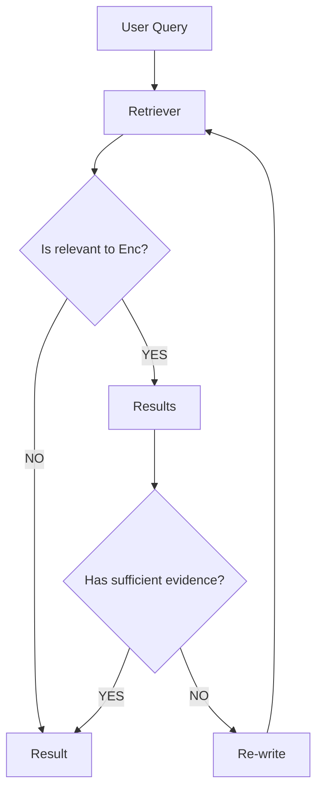

---

## 7. Adaptive RAG

**Description**: Dynamically decides when to retrieve external knowledge, balancing internal and external knowledge sources.

**Key Features**:
- Dynamically decides when to retrieve external knowledge, balancing internal and external knowledge
- Uses confidence scores from the language model's internal states to assess retrieval necessity
- An honesty probe helps the model avoid hallucinations by aligning its output with its actual knowledge
- Reduces unnecessary retrievals, improving both efficiency and response accuracy

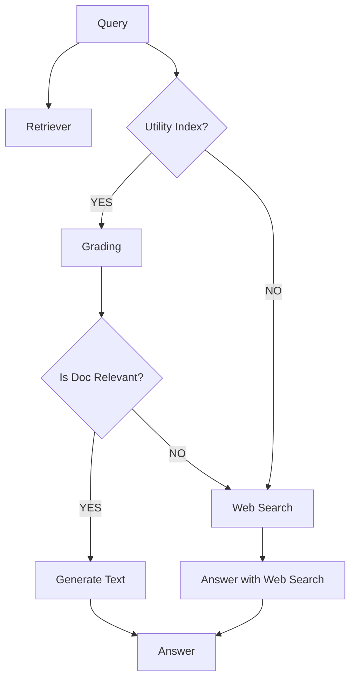

---

## 8. REFEED Retrieval Feedback

**Description**: Refines model outputs using retrieval feedback without fine-tuning, generating multiple answers for improved accuracy.

**Key Features**:
- REFEED refines model outputs using retrieval feedback without fine-tuning
- Initial answers are improved by retrieving relevant documents and adjusting the response based on the new information
- Generates multiple answers to improve retrieval accuracy
- Combines pre- and post-retrieval outputs using a ranking system to enhance answer reliability

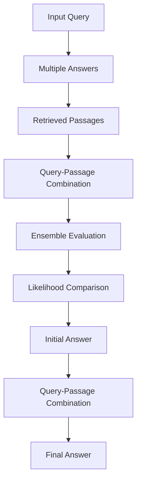

---

## 9. REALM

**Description**: Retrieves relevant documents from large corpora like Wikipedia to enhance model predictions through masked language modeling.

**Key Features**:
- REALM retrieves relevant documents from large corpora like Wikipedia to enhance model predictions
- The retriever is trained with masked language modeling, optimizing retrieval to improve prediction accuracy
- Uses Maximum Inner Product Search to efficiently find relevant documents from millions of candidates during training
- REALM outperforms previous models in Open-domain Question Answering by integrating external knowledge

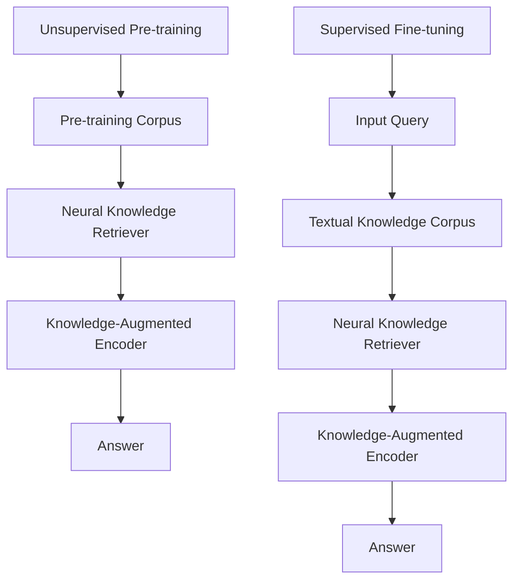

---

## 10. RAPTOR - Tree-Organized Retrieval

**Description**: Builds a hierarchical tree by clustering and summarizing text recursively for multi-level retrieval.

**Key Features**:
- RAPTOR builds a hierarchical tree by clustering and summarizing text recursively
- Enables retrieval at different abstraction levels, combining broad themes with specific details
- RAPTOR outperforms traditional methods in complex question-answering tasks
- Offers tree traversal and collapsed tree methods for efficient information retrieval

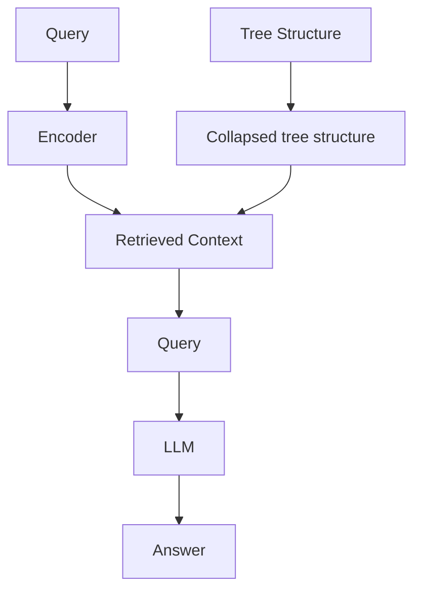

---

## 11. REVEAL for Visual-Language Model

**Description**: Combines reasoning with task-specific actions and external knowledge for visual-language tasks.

**Key Features**:
- Combines reasoning with task-specific actions and external knowledge, improving decision-making
- Minimizes errors by grounding reasoning in real-world facts, reducing inaccuracies and hallucinations
- Offers clear, human-like task-solving steps, enhancing transparency and interpretability
- REVEAL achieves strong performance across tasks with fewer training examples, making models efficient, adaptable, and responsive

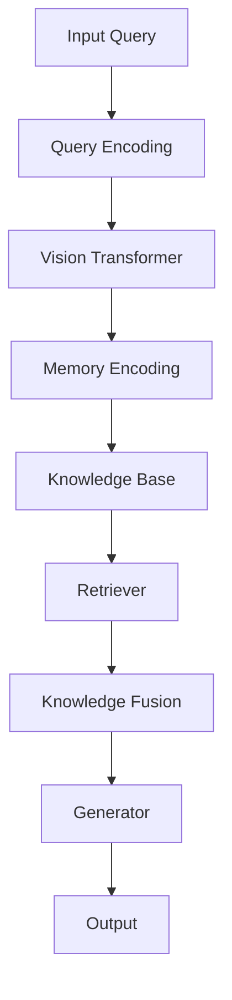

---

## 12. REACT

**Description**: Combines reasoning and action, allowing models to interact with their environment while maintaining situational awareness.

**Key Features**:
- Combines reasoning and action, allowing models to interact with their environment
- Maintains situational awareness by updating context with past actions and thoughts
- Generates task-aligned thoughts to guide logical decision-making
- Real-time feedback refines understanding, reducing errors and enhancing transparency and reliability

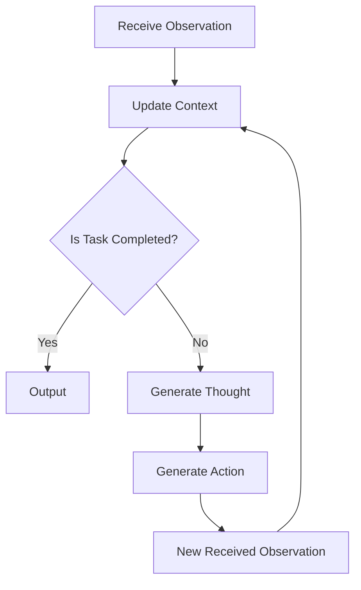

---

## 13. REPLUG Retrieval Plugin

**Description**: Enhances LLMs by retrieving relevant external documents as a flexible plugin that works with existing models.

**Key Features**:
- REPLUG enhances LLMs by retrieving relevant external documents to improve prediction accuracy
- Treats the language model as a fixed "black box," prepending retrieved information to the input
- Flexible design works with existing models without modifications, integrating external knowledge to reduce errors and hallucinations
- The retrieval component can be fine-tuned with model feedback, aligning better with the model's needs and expanding niche knowledge

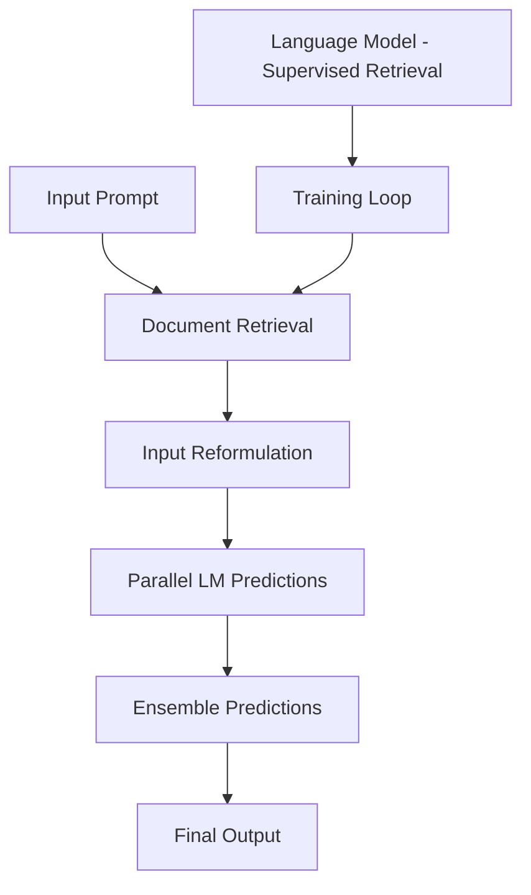

---

## 14. MEMO RAG

**Description**: Combines memory and retrieval to handle complex queries with draft answer generation for external information guidance.

**Key Features**:
- Memo RAG combines memory and retrieval to handle complex queries
- A memory model generates draft answers that guide the search for external information
- The retriever then gathers relevant data from databases, which a more powerful language model uses to create a comprehensive final answer
- This method helps Memo RAG manage ambiguous queries and efficiently process large amounts of information across various tasks

```mermaid
flowchart TD
    A[User Input Query] --> B[Memory Model (Light LLM)]
    B --> C[Generates Clues]
    C --> D[Clue-Based Retriever]
    D --> E[Retrieves Context]
    E --> F[Answer Generation (Heavy LLM)]
    F --> G[Answer]
```

---

## 15. Attention-based RAG (ATLAS)

**Description**: Uses a dual-encoder retriever and Fusion-in-Decoder model to improve language models with external document retrieval.

**Key Features**:
- ATLAS improves language models by retrieving external documents to enhance accuracy, especially in question-answering tasks
- Uses a dual-encoder retriever to identify the top-K relevant documents from large text corpora
- A Fusion-in-Decoder model integrates query and document information, generating accurate responses while reducing reliance on memorization
- The document index is updatable without retraining, ensuring it remains current and effective for knowledge-intensive tasks

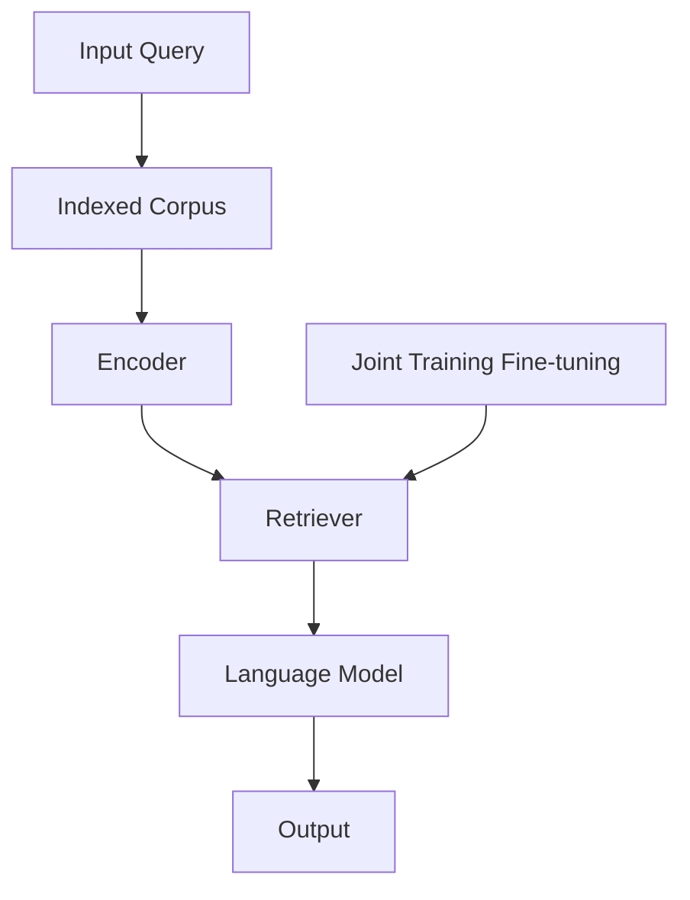

---

## 16. RETRO

**Description**: Splits input text into chunks and retrieves similar information from a large text database to enrich context.

**Key Features**:
- RETRO splits input text into chunks and retrieves similar information from a large text database to enrich context
- Uses pre-trained BERT embeddings to pull in relevant chunks from external data, enhancing context
- Chunked cross-attention integrates these chunks, improving predictions without a major increase in model size
- This approach enhances tasks like question answering and text generation efficiently, accessing extensive knowledge with lower computational demands than larger models

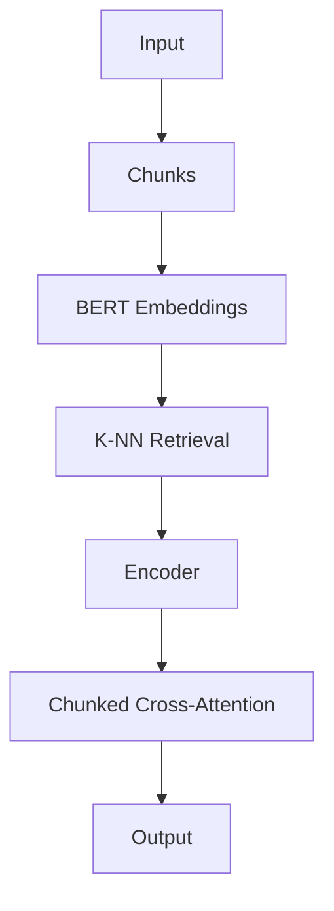

---

## 17. AUTO RAG

**Description**: Automates optimization for Retrieval-Augmented Generation systems with modular, node-based structure for testing configurations.

**Key Features**:
- AutoRAG automates optimization for Retrieval-Augmented Generation (RAG) systems
- Evaluates modules like query expansion, retrieval, and reranking for best performance
- The framework uses a modular, node-based structure to test various configurations
- A greedy optimization approach enhances efficiency across different datasets

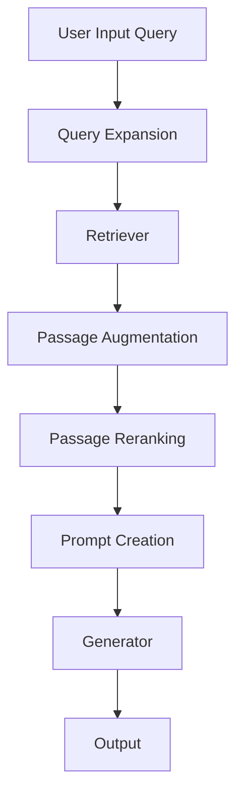

---

## 18. CORAG: Cost-Constrained RAG

**Description**: Enhances RAG by optimizing relevant chunk selection from databases while considering cost constraints.

**Key Features**:
- Enhances RAG by optimizing relevant chunk selection from databases
- Tackles three challenges: correlating chunks efficiently, handling non-monotonic utility where adding chunks may reduce utility, and adapting to diverse query types
- CORAG uses Monte Carlo Tree Search (MCTS) for optimal chunk combination while factoring in cost constraints, achieving up to a 30% improvement over baseline models

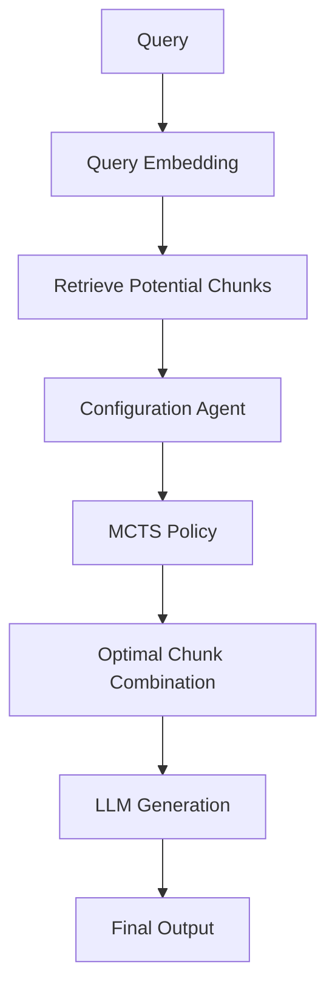

---

## 19. EACO-RAG

**Description**: Enhances RAG with edge computing for faster, efficient responses using distributed vector datasets.

**Key Features**:
- EACO-RAG enhances RAG with edge computing for faster, efficient responses
- Vector datasets are distributed across edge nodes, reducing delays and resource use
- Adaptive knowledge updates and inter-node collaboration improve response accuracy
- A multi-armed bandit approach optimizes cost, accuracy, and delay in real-time

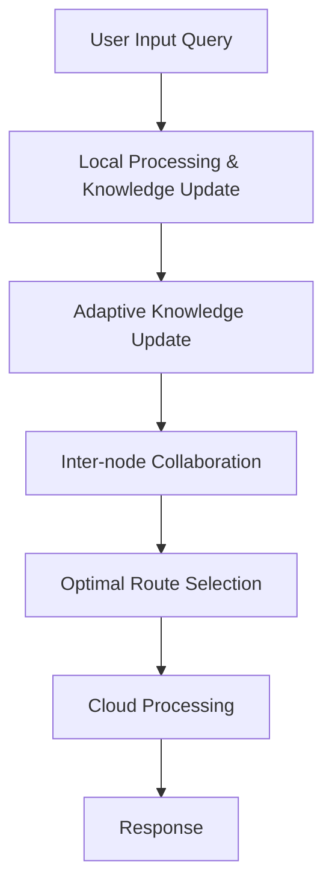

---

## 20. RULE RAG

**Description**: Enhances question answering by adding rule-based guidance to RAG for logical document retrieval and answer generation.

**Key Features**:
- Rule-RAG enhances question answering by adding rule-based guidance to RAG
- Retrieves documents logically relevant to queries using predefined rules
- Rules are also used to guide answer generation for accuracy and context
- Includes in-context learning (ICL) and a fine-tuned version (FT) for better retrieval and generation

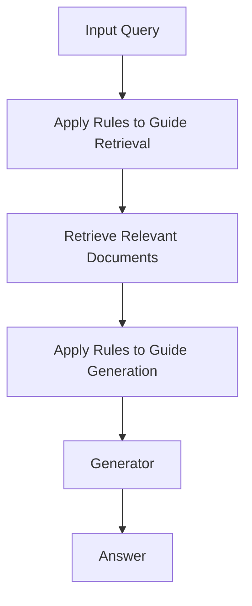

---

## 21. Conversational RAG (CORAL)

**Description**: Benchmarks multi-turn conversational RAG using Wikipedia data, handling open-domain, realistic conversations.

**Key Features**:
- CORAL benchmarks multi-turn conversational RAG using Wikipedia data
- Evaluates passage retrieval, response generation, and citation labeling
- CORAL handles open-domain, realistic, multi-turn conversations
- Bridges single-turn RAG research and real-world multi-turn needs

```mermaid
flowchart TD
    A[Data Source] --> B[Title Extraction]
    B --> C[Conversation Flow Sampling]
    C --> D[Contextualization]
    D --> E[Benchmark Tasks]
    E --> F[Passage Retrieval]
    E --> G[Response Generation]
    E --> H[Citation Labeling]
```

---

## 22. Iterative RAG

**Description**: Performs multiple retrieval steps, refining search based on feedback from previously selected documents.

**Key Features**:
- Unlike traditional retrieval, iterative RAG performs multiple retrieval steps, refining its search based on feedback from previously selected documents
- Retrieval decisions follow a Markov decision process
- Reinforcement learning improves retrieval performance
- The iterative retriever maintains an internal state, allowing it to adjust future retrieval steps based on the accumulated knowledge from previous iterations

```mermaid
flowchart TD
    A[Input Query] --> B[Search Retrieval Methods]
    B --> C[Query Vector]
    C --> D[Retrieve Documents]
    D --> E[Select Exemplars]
    E --> F[Large Language Model]
    F --> G[Reward Feedback]
    G --> H[Policy Optimization]
    H --> I[Answer]
```

---

## 23. Context-driven Tree-structured Retrieval (ConTReGen)

**Description**: A context-driven, tree-structured RAG approach that decomposes complex queries into hierarchical sub-queries.

**Key Features**:
- A context-driven, tree-structured RAG approach that decomposes complex queries into hierarchical sub-queries, enhancing retrieval depth
- Workflow has two stages: a top-down exploration of query facets, creating a tree of retrieved passages, followed by bottom-up synthesis, integrating summarized information to produce a coherent long-form response
- This framework reduces gaps in information and improves the quality of generated content

```mermaid
flowchart TD
    A[Input Query] --> B[Top-Down Planning & Retrieval Stage]
    B --> C[Analyze Query and Generate Initial Sub-Queries]
    C --> D[For each Sub-Query]
    D --> E[Passage Retrieval]
    E --> F[Verify]
    F --> G[Build Tree]
    
    G --> H[Bottom-Up Synthesis & Generation Stage]
    H --> I[Start from Leaf Nodes of Tree]
    I --> J[Summarize Retrieved Content at Each Node]
    J --> K[Integrate Summaries Upwards from Leaf to Root]
    K --> L[Response]
```

---

## 24. Causality-Enhanced Reflective and Retrieval-Augmented Translation (CRAT)

**Description**: Multi-Agent Framework that enhances translation by detecting, clarifying, and translating ambiguous terms using knowledge graphs.

**Key Features**:
- Multi-Agent Framework: CRAT enhances translation by detecting, clarifying, and translating ambiguous terms
- Knowledge Graph: Combines internal and external sources to capture context for accurate term use
- Causality Validation: A judge agent validates information to ensure context-aligned translations
- Refined Output: CRAT delivers precise, consistent translations by using validated knowledge

```mermaid
flowchart TD
    A[Source Context Input] --> B[Unknown Terms Detector]
    B --> C[Knowledge Graph Constructor]
    C --> D[Causality-enhanced Judge]
    D --> E[Translator]
    E --> F[Output]
```

---

## 25. Graph RAG

**Description**: Constructs a knowledge graph on-the-fly, linking relevant entities during retrieval for improved efficiency and accuracy.

**Key Features**:
- Graph RAG constructs a knowledge graph on-the-fly, linking relevant entities during retrieval
- Leverages node relationships to decide when and how much external knowledge to retrieve
- Confidence scores from the graph guide expansion, avoiding irrelevant additions
- This approach improves efficiency and response accuracy by keeping the knowledge graph compact and relevant

```mermaid
flowchart TD
    A[Documents] --> B[Compose Text Units]
    B --> C[Embedded Chunks]
    C --> D[Text Units]
    
    D --> E[Graph Extraction]
    E --> F[Entity & Relation Extraction]
    F --> G[Entity & Relation Summarization]
    G --> H[Claim Extraction]
    
    H --> I[Graph Augmentation]
    I --> J[Community Detection]
    J --> K[Graph Embeddings]
    K --> L[Community Summarization]
    
    L --> M[Network Visualization]
    M --> N[Query Processing]
    N --> O[Knowledge Graph Response]
```

---

## Conclusion

This comprehensive guide covers 25 different RAG approaches, each designed to address specific challenges in retrieval-augmented generation:

- **Foundational**: Standard RAG, Corrective RAG
- **Optimization-focused**: Adaptive RAG, AUTO RAG, CORAG
- **Multi-model**: Speculative RAG, Fusion RAG, MEMO RAG
- **Agent-based**: Agentic RAG, REACT
- **Self-improving**: Self RAG, Iterative RAG
- **Specialized domains**: REVEAL (visual), CRAT (translation), Conversational RAG
- **Advanced architectures**: Graph RAG, RAPTOR, REALM
- **Efficiency-focused**: RETRO, EACO-RAG, REPLUG
- **Rule-based**: RULE RAG
- **Feedback-driven**: REFEED, ATLAS

Each approach offers unique advantages and is suited for different use cases, from real-time applications to complex multi-turn conversations and specialized domain tasks.

Based on the 25 RAG types you've documented, I'll provide an analysis of their real-world relevance, necessity, and typical use cases from a public and industry perspective:

🎯 Most Essential RAG Types (High Industry Adoption)
1. Standard RAG ⭐⭐⭐⭐⭐
Real-world necessity: Absolutely essential - foundational approach
Use cases: ChatGPT plugins, customer support bots, document Q&A systems
Industry adoption: Universal - used by OpenAI, Anthropic, Microsoft Copilot
2. Conversational RAG (CORAL) ⭐⭐⭐⭐⭐
Real-world necessity: Critical for modern applications
Use cases: Multi-turn chatbots, virtual assistants, customer service
Industry adoption: Widely implemented in enterprise solutions
3. Graph RAG ⭐⭐⭐⭐⭐
Real-world necessity: Increasingly important for complex knowledge
Use cases: Microsoft's Graph RAG implementation, knowledge graphs, complex enterprise data
Industry adoption: Microsoft, Neo4j, enterprise knowledge management
🚀 High-Value Specialized RAG Types
4. Adaptive RAG ⭐⭐⭐⭐
Real-world necessity: Very valuable for cost optimization
Use cases: Production systems needing cost control, dynamic retrieval decisions
Industry adoption: Used by companies optimizing LLM costs
5. Fusion RAG ⭐⭐⭐⭐
Real-world necessity: Important for robustness
Use cases: Enterprise search, multi-source information systems
Industry adoption: Google's multi-modal search, enterprise solutions
6. AUTO RAG ⭐⭐⭐⭐
Real-world necessity: Critical for production optimization
Use cases: Automated RAG pipeline optimization, MLOps
Industry adoption: Growing adoption in AI/ML platforms
🔬 Research-Heavy but Practically Useful
7. REALM ⭐⭐⭐
Real-world necessity: Research foundation, limited direct use
Use cases: Academic research, specialized NLP applications
Industry adoption: More academic than commercial
8. RETRO ⭐⭐⭐
Real-world necessity: Interesting but limited adoption
Use cases: Memory-efficient language models
Industry adoption: Primarily research-focused (DeepMind)
9. RAPTOR ⭐⭐⭐
Real-world necessity: Useful for hierarchical information
Use cases: Legal document analysis, academic paper processing
Industry adoption: Specialized applications
💼 Industry-Specific RAG Types
10. CORAG (Cost-Constrained) ⭐⭐⭐⭐
Real-world necessity: Very important for production
Use cases: Enterprise RAG with budget constraints, optimization
Industry adoption: Growing in cost-conscious deployments
11. EACO-RAG (Edge Computing) ⭐⭐⭐
Real-world necessity: Niche but growing
Use cases: Mobile applications, IoT, edge AI
Industry adoption: Limited but increasing with edge AI growth
12. CRAT (Translation) ⭐⭐
Real-world necessity: Very specialized
Use cases: Professional translation services, multilingual applications
Industry adoption: Limited to translation industry
🤖 Agent-Based and Advanced Patterns
13. Agentic RAG ⭐⭐⭐⭐
Real-world necessity: Growing importance
Use cases: AI agents, complex reasoning systems
Industry adoption: Emerging in AI agent frameworks
14. REACT ⭐⭐⭐⭐
Real-world necessity: Important for interactive systems
Use cases: AI assistants, tool-using agents
Industry adoption: Used in various AI agent implementations
📊 Analysis Summary
Really Needed (Top 10):
Standard RAG - Universal foundation
Conversational RAG - Modern necessity
Graph RAG - Enterprise critical
Adaptive RAG - Cost optimization
Fusion RAG - Robustness
AUTO RAG - Production efficiency
CORAG - Budget management
Agentic RAG - Future direction
REACT - Interactive systems
Corrective RAG - Quality improvement
Specialized but Valuable (Next 8):
Self RAG - Quality enhancement
Iterative RAG - Complex queries
MEMO RAG - Memory systems
REPLUG - Plugin architecture
ATLAS - Academic/research
RULE RAG - Structured domains
REVEAL - Visual tasks
EACO-RAG - Edge computing
Research/Niche (Bottom 7):
REALM - Academic foundation
RETRO - Memory efficiency
RAPTOR - Document hierarchy
REFEED - Feedback systems
ConTReGen - Complex synthesis
CRAT - Translation specific
Speculative RAG - Optimization
🎯 Real-World Use Case Mapping
Enterprise Knowledge Management: Graph RAG, Conversational RAG, Fusion RAG
Customer Support: Standard RAG, Conversational RAG, Corrective RAG
Cost-Sensitive Applications: Adaptive RAG, CORAG, AUTO RAG
Research & Academia: REALM, RETRO, RAPTOR
Mobile/Edge: EACO-RAG, lightweight variants
Translation Services: CRAT
AI Agents: Agentic RAG, REACT
Complex Documents: ConTReGen, RAPTOR, Graph RAG

📈 Industry Opinion
Most practitioners agree:

~10-12 RAG types cover 90% of real-world needs
Standard, Conversational, and Graph RAG are must-haves
Many variants are research explorations rather than production necessities
The complexity often isn't justified by performance gains
Industry tends to focus on robust implementation of fewer approaches rather than experimenting with all variants
Bottom line: While all 25 have academic merit, about 10-12 serve the majority of practical use cases effectively.