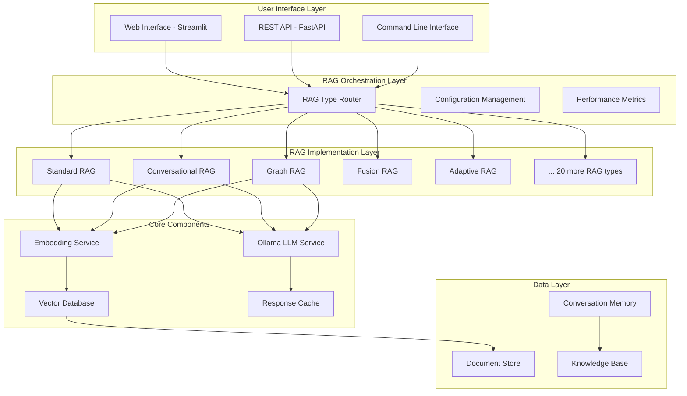

# 🛠️ Technical Implementation Plan: 25 RAG Systems with Ollama

## 📐 Architecture Overview

### System Architecture Diagram



## 🏗️ Core Implementation Framework

### Base RAG Interface

```python
# common/base_rag.py
from abc import ABC, abstractmethod
from typing import List, Dict, Any, Optional
from dataclasses import dataclass
from enum import Enum

class RAGType(Enum):
    STANDARD = "standard"
    CONVERSATIONAL = "conversational"
    GRAPH = "graph"
    FUSION = "fusion"
    ADAPTIVE = "adaptive"
    # ... add all 25 types

@dataclass
class RAGQuery:
    text: str
    context: Optional[Dict[str, Any]] = None
    session_id: Optional[str] = None
    max_tokens: int = 512
    temperature: float = 0.7
    top_k: int = 5

@dataclass
class RAGResponse:
    answer: str
    sources: List[Dict[str, Any]]
    confidence: float
    retrieval_time: float
    generation_time: float
    metadata: Dict[str, Any]

class BaseRAG(ABC):
    def __init__(self, config: Dict[str, Any]):
        self.config = config
        self.rag_type = self._get_rag_type()
        self.ollama_client = self._initialize_ollama()
        self.vector_store = self._initialize_vector_store()
        self.embeddings = self._initialize_embeddings()
    
    @abstractmethod
    def _get_rag_type(self) -> RAGType:
        pass
    
    @abstractmethod
    def process_query(self, query: RAGQuery) -> RAGResponse:
        pass
    
    @abstractmethod
    def add_documents(self, documents: List[Dict[str, Any]]) -> bool:
        pass
    
    def _initialize_ollama(self):
        # Ollama client initialization
        pass
    
    def _initialize_vector_store(self):
        # Vector database initialization
        pass
    
    def _initialize_embeddings(self):
        # Embedding model initialization
        pass
```

### Ollama Integration Service

```python
# common/ollama_service.py
import ollama
from typing import Dict, List, Any, Generator
import json
import time

class OllamaService:
    def __init__(self, model_name: str = "llama2", host: str = "localhost:11434"):
        self.model_name = model_name
        self.host = host
        self.client = ollama.Client(host=host)
        self._ensure_model_available()
    
    def _ensure_model_available(self):
        """Ensure the specified model is available locally"""
        try:
            models = self.client.list()['models']
            if not any(model['name'].startswith(self.model_name) for model in models):
                print(f"Pulling model {self.model_name}...")
                self.client.pull(self.model_name)
        except Exception as e:
            raise Exception(f"Failed to initialize Ollama model: {e}")
    
    def generate(self, prompt: str, context: str = "", **kwargs) -> Dict[str, Any]:
        """Generate response using Ollama"""
        start_time = time.time()
        
        full_prompt = f"Context: {context}\n\nQuestion: {prompt}\n\nAnswer:"
        
        try:
            response = self.client.generate(
                model=self.model_name,
                prompt=full_prompt,
                **kwargs
            )
            
            generation_time = time.time() - start_time
            
            return {
                'text': response['response'],
                'generation_time': generation_time,
                'model': self.model_name,
                'tokens_generated': len(response['response'].split()),
                'metadata': {
                    'eval_count': response.get('eval_count', 0),
                    'eval_duration': response.get('eval_duration', 0),
                }
            }
        except Exception as e:
            raise Exception(f"Ollama generation failed: {e}")
    
    def generate_stream(self, prompt: str, context: str = "", **kwargs) -> Generator[str, None, None]:
        """Generate streaming response using Ollama"""
        full_prompt = f"Context: {context}\n\nQuestion: {prompt}\n\nAnswer:"
        
        try:
            stream = self.client.generate(
                model=self.model_name,
                prompt=full_prompt,
                stream=True,
                **kwargs
            )
            
            for chunk in stream:
                if 'response' in chunk:
                    yield chunk['response']
        except Exception as e:
            raise Exception(f"Ollama streaming failed: {e}")
```

## 🎯 Priority Implementation Templates

### 1. Standard RAG Implementation

```python
# rag_types/01_standard/standard_rag.py
from common.base_rag import BaseRAG, RAGType, RAGQuery, RAGResponse
from common.ollama_service import OllamaService
import chromadb
from sentence_transformers import SentenceTransformer
import time
from typing import List, Dict, Any

class StandardRAG(BaseRAG):
    def __init__(self, config: Dict[str, Any]):
        super().__init__(config)
        self.chunk_size = config.get('chunk_size', 512)
        self.chunk_overlap = config.get('chunk_overlap', 50)
        
    def _get_rag_type(self) -> RAGType:
        return RAGType.STANDARD
    
    def _initialize_ollama(self):
        return OllamaService(
            model_name=self.config.get('ollama_model', 'llama2'),
            host=self.config.get('ollama_host', 'localhost:11434')
        )
    
    def _initialize_vector_store(self):
        client = chromadb.PersistentClient(path=self.config.get('chroma_path', './chroma_db'))
        collection_name = f"standard_rag_{self.config.get('collection_suffix', 'default')}"
        return client.get_or_create_collection(name=collection_name)
    
    def _initialize_embeddings(self):
        model_name = self.config.get('embedding_model', 'all-MiniLM-L6-v2')
        return SentenceTransformer(model_name)
    
    def add_documents(self, documents: List[Dict[str, Any]]) -> bool:
        """Add documents to the vector store"""
        try:
            texts = []
            metadatas = []
            ids = []
            
            for i, doc in enumerate(documents):
                chunks = self._chunk_document(doc['text'])
                for j, chunk in enumerate(chunks):
                    texts.append(chunk)
                    metadatas.append({
                        'source': doc.get('source', f'doc_{i}'),
                        'chunk_id': j,
                        'original_length': len(doc['text'])
                    })
                    ids.append(f"{doc.get('source', f'doc_{i}')}_{j}")
            
            # Generate embeddings
            embeddings = self.embeddings.encode(texts).tolist()
            
            # Add to vector store
            self.vector_store.add(
                embeddings=embeddings,
                documents=texts,
                metadatas=metadatas,
                ids=ids
            )
            
            return True
        except Exception as e:
            print(f"Error adding documents: {e}")
            return False
    
    def _chunk_document(self, text: str) -> List[str]:
        """Simple text chunking strategy"""
        words = text.split()
        chunks = []
        
        for i in range(0, len(words), self.chunk_size - self.chunk_overlap):
            chunk_words = words[i:i + self.chunk_size]
            chunks.append(' '.join(chunk_words))
        
        return chunks
    
    def process_query(self, query: RAGQuery) -> RAGResponse:
        """Process a query using standard RAG approach"""
        start_time = time.time()
        
        # 1. Retrieve relevant documents
        retrieval_start = time.time()
        query_embedding = self.embeddings.encode([query.text]).tolist()
        
        results = self.vector_store.query(
            query_embeddings=query_embedding,
            n_results=query.top_k
        )
        
        retrieval_time = time.time() - retrieval_start
        
        # 2. Prepare context
        context_chunks = results['documents'][0] if results['documents'] else []
        context = "\n\n".join(context_chunks)
        
        # 3. Generate response using Ollama
        generation_start = time.time()
        ollama_response = self.ollama_client.generate(
            prompt=query.text,
            context=context,
            temperature=query.temperature,
            max_tokens=query.max_tokens
        )
        generation_time = time.time() - generation_start
        
        # 4. Prepare response
        sources = []
        if results['metadatas']:
            for i, metadata in enumerate(results['metadatas'][0]):
                sources.append({
                    'content': results['documents'][0][i],
                    'source': metadata.get('source', 'unknown'),
                    'chunk_id': metadata.get('chunk_id', i),
                    'distance': results['distances'][0][i] if results['distances'] else 0.0
                })
        
        total_time = time.time() - start_time
        
        return RAGResponse(
            answer=ollama_response['text'],
            sources=sources,
            confidence=self._calculate_confidence(results, ollama_response),
            retrieval_time=retrieval_time,
            generation_time=generation_time,
            metadata={
                'total_time': total_time,
                'model_used': ollama_response['model'],
                'tokens_generated': ollama_response['tokens_generated'],
                'context_length': len(context)
            }
        )
    
    def _calculate_confidence(self, retrieval_results, generation_result) -> float:
        """Calculate confidence score based on retrieval quality and generation metadata"""
        if not retrieval_results['distances'] or not retrieval_results['distances'][0]:
            return 0.5
        
        # Simple confidence based on retrieval distances
        avg_distance = sum(retrieval_results['distances'][0]) / len(retrieval_results['distances'][0])
        confidence = max(0.0, min(1.0, 1.0 - avg_distance))
        
        return confidence
```

### 2. Conversational RAG Implementation

```python
# rag_types/02_conversational/conversational_rag.py
from common.base_rag import BaseRAG, RAGType, RAGQuery, RAGResponse
from typing import List, Dict, Any, Optional
import json
import time
from datetime import datetime

class ConversationMemory:
    def __init__(self, max_history: int = 10):
        self.conversations: Dict[str, List[Dict]] = {}
        self.max_history = max_history
    
    def add_exchange(self, session_id: str, query: str, response: str, context: List[str]):
        if session_id not in self.conversations:
            self.conversations[session_id] = []
        
        exchange = {
            'timestamp': datetime.now().isoformat(),
            'query': query,
            'response': response,
            'context': context
        }
        
        self.conversations[session_id].append(exchange)
        
        # Keep only recent history
        if len(self.conversations[session_id]) > self.max_history:
            self.conversations[session_id] = self.conversations[session_id][-self.max_history:]
    
    def get_history(self, session_id: str) -> List[Dict]:
        return self.conversations.get(session_id, [])
    
    def clear_session(self, session_id: str):
        if session_id in self.conversations:
            del self.conversations[session_id]

class ConversationalRAG(BaseRAG):
    def __init__(self, config: Dict[str, Any]):
        super().__init__(config)
        self.memory = ConversationMemory(
            max_history=config.get('max_conversation_history', 10)
        )
        self.context_window = config.get('context_window', 4000)
    
    def _get_rag_type(self) -> RAGType:
        return RAGType.CONVERSATIONAL
    
    def process_query(self, query: RAGQuery) -> RAGResponse:
        """Process a conversational query with history awareness"""
        start_time = time.time()
        session_id = query.session_id or "default"
        
        # 1. Get conversation history
        history = self.memory.get_history(session_id)
        
        # 2. Create context-aware query
        enhanced_query = self._enhance_query_with_history(query.text, history)
        
        # 3. Retrieve relevant documents
        retrieval_start = time.time()
        query_embedding = self.embeddings.encode([enhanced_query]).tolist()
        
        results = self.vector_store.query(
            query_embeddings=query_embedding,
            n_results=query.top_k
        )
        
        retrieval_time = time.time() - retrieval_start
        
        # 4. Prepare context with conversation history
        context_chunks = results['documents'][0] if results['documents'] else []
        conversation_context = self._build_conversation_context(history, context_chunks)
        
        # 5. Generate response using Ollama
        generation_start = time.time()
        ollama_response = self.ollama_client.generate(
            prompt=query.text,
            context=conversation_context,
            temperature=query.temperature,
            max_tokens=query.max_tokens
        )
        generation_time = time.time() - generation_start
        
        # 6. Store conversation exchange
        self.memory.add_exchange(
            session_id=session_id,
            query=query.text,
            response=ollama_response['text'],
            context=context_chunks
        )
        
        # 7. Prepare response
        sources = self._format_sources(results)
        total_time = time.time() - start_time
        
        return RAGResponse(
            answer=ollama_response['text'],
            sources=sources,
            confidence=self._calculate_confidence(results, ollama_response),
            retrieval_time=retrieval_time,
            generation_time=generation_time,
            metadata={
                'total_time': total_time,
                'session_id': session_id,
                'conversation_turns': len(history),
                'enhanced_query': enhanced_query,
                'context_length': len(conversation_context)
            }
        )
    
    def _enhance_query_with_history(self, current_query: str, history: List[Dict]) -> str:
        """Enhance current query with relevant conversation history"""
        if not history:
            return current_query
        
        # Take last few exchanges for context
        recent_history = history[-3:] if len(history) > 3 else history
        
        history_context = []
        for exchange in recent_history:
            history_context.append(f"Previous Q: {exchange['query']}")
            history_context.append(f"Previous A: {exchange['response'][:200]}...")
        
        enhanced_query = f"""
Conversation History:
{chr(10).join(history_context)}

Current Question: {current_query}
"""
        return enhanced_query
    
    def _build_conversation_context(self, history: List[Dict], retrieved_chunks: List[str]) -> str:
        """Build comprehensive context including history and retrieved documents"""
        context_parts = []
        
        # Add recent conversation context
        if history:
            recent_exchanges = history[-2:] if len(history) > 2 else history
            conversation_summary = []
            for exchange in recent_exchanges:
                conversation_summary.append(f"Q: {exchange['query']}")
                conversation_summary.append(f"A: {exchange['response'][:150]}...")
            
            context_parts.append("Recent Conversation:")
            context_parts.append("\n".join(conversation_summary))
        
        # Add retrieved documents
        if retrieved_chunks:
            context_parts.append("\nRelevant Information:")
            context_parts.extend(retrieved_chunks[:3])  # Limit to avoid context overflow
        
        full_context = "\n\n".join(context_parts)
        
        # Ensure context doesn't exceed window
        if len(full_context) > self.context_window:
            full_context = full_context[:self.context_window]
        
        return full_context
    
    def clear_conversation(self, session_id: str):
        """Clear conversation history for a session"""
        self.memory.clear_session(session_id)
```

### 3. Graph RAG Implementation

```python
# rag_types/03_graph/graph_rag.py
from common.base_rag import BaseRAG, RAGType, RAGQuery, RAGResponse
import networkx as nx
import spacy
from typing import List, Dict, Any, Set, Tuple
import json
import time

class KnowledgeGraph:
    def __init__(self):
        self.graph = nx.DiGraph()
        self.entity_embeddings = {}
        self.nlp = spacy.load("en_core_web_sm")
    
    def add_document(self, doc_text: str, doc_id: str):
        """Extract entities and relationships from document and add to graph"""
        doc = self.nlp(doc_text)
        
        # Extract entities
        entities = [(ent.text, ent.label_) for ent in doc.ents]
        
        # Add entities to graph
        for entity, entity_type in entities:
            if not self.graph.has_node(entity):
                self.graph.add_node(entity, type=entity_type, documents=[doc_id])
            else:
                self.graph.nodes[entity]['documents'].append(doc_id)
        
        # Extract relationships (simple: entities in same sentence are related)
        for sent in doc.sents:
            sent_entities = [ent.text for ent in sent.ents]
            for i, entity1 in enumerate(sent_entities):
                for entity2 in sent_entities[i+1:]:
                    if entity1 != entity2:
                        if self.graph.has_edge(entity1, entity2):
                            self.graph[entity1][entity2]['weight'] += 1
                        else:
                            self.graph.add_edge(entity1, entity2, weight=1, documents=[doc_id])
    
    def find_relevant_subgraph(self, query_entities: List[str], max_nodes: int = 20) -> nx.DiGraph:
        """Find relevant subgraph based on query entities"""
        if not query_entities:
            return nx.DiGraph()
        
        relevant_nodes = set()
        
        # Add query entities if they exist in graph
        for entity in query_entities:
            if self.graph.has_node(entity):
                relevant_nodes.add(entity)
        
        # Expand to neighbors
        for entity in list(relevant_nodes):
            if self.graph.has_node(entity):
                neighbors = list(self.graph.neighbors(entity))
                relevant_nodes.update(neighbors[:5])  # Limit neighbors
        
        # Limit total nodes
        if len(relevant_nodes) > max_nodes:
            # Keep most connected nodes
            node_degrees = [(node, self.graph.degree(node)) for node in relevant_nodes]
            node_degrees.sort(key=lambda x: x[1], reverse=True)
            relevant_nodes = set([node for node, _ in node_degrees[:max_nodes]])
        
        return self.graph.subgraph(relevant_nodes)
    
    def get_node_context(self, node: str) -> str:
        """Get contextual information about a node"""
        if not self.graph.has_node(node):
            return ""
        
        node_data = self.graph.nodes[node]
        context_parts = [f"Entity: {node} (Type: {node_data.get('type', 'Unknown')})"]
        
        # Add connections
        neighbors = list(self.graph.neighbors(node))
        if neighbors:
            context_parts.append(f"Connected to: {', '.join(neighbors[:5])}")
        
        return ". ".join(context_parts)

class GraphRAG(BaseRAG):
    def __init__(self, config: Dict[str, Any]):
        super().__init__(config)
        self.knowledge_graph = KnowledgeGraph()
        self.entity_extraction_threshold = config.get('entity_threshold', 0.5)
    
    def _get_rag_type(self) -> RAGType:
        return RAGType.GRAPH
    
    def add_documents(self, documents: List[Dict[str, Any]]) -> bool:
        """Add documents to both vector store and knowledge graph"""
        try:
            # Add to vector store (parent implementation)
            vector_success = super().add_documents(documents)
            
            # Add to knowledge graph
            for doc in documents:
                doc_id = doc.get('id', doc.get('source', 'unknown'))
                self.knowledge_graph.add_document(doc['text'], doc_id)
            
            return vector_success
        except Exception as e:
            print(f"Error adding documents to Graph RAG: {e}")
            return False
    
    def process_query(self, query: RAGQuery) -> RAGResponse:
        """Process query using graph-enhanced retrieval"""
        start_time = time.time()
        
        # 1. Extract entities from query
        query_entities = self._extract_query_entities(query.text)
        
        # 2. Find relevant subgraph
        subgraph = self.knowledge_graph.find_relevant_subgraph(query_entities)
        
        # 3. Enhanced retrieval using both vector similarity and graph context
        retrieval_start = time.time()
        
        # Vector retrieval
        query_embedding = self.embeddings.encode([query.text]).tolist()
        vector_results = self.vector_store.query(
            query_embeddings=query_embedding,
            n_results=query.top_k
        )
        
        # Graph-based context enhancement
        graph_context = self._build_graph_context(subgraph, query_entities)
        
        retrieval_time = time.time() - retrieval_start
        
        # 4. Combine vector and graph contexts
        vector_context = "\n\n".join(vector_results['documents'][0] if vector_results['documents'] else [])
        
        combined_context = f"""
Graph Knowledge:
{graph_context}

Retrieved Documents:
{vector_context}
"""
        
        # 5. Generate response using Ollama
        generation_start = time.time()
        ollama_response = self.ollama_client.generate(
            prompt=query.text,
            context=combined_context,
            temperature=query.temperature,
            max_tokens=query.max_tokens
        )
        generation_time = time.time() - generation_start
        
        # 6. Prepare enhanced response with graph information
        sources = self._format_sources_with_graph(vector_results, subgraph)
        total_time = time.time() - start_time
        
        return RAGResponse(
            answer=ollama_response['text'],
            sources=sources,
            confidence=self._calculate_graph_confidence(vector_results, subgraph),
            retrieval_time=retrieval_time,
            generation_time=generation_time,
            metadata={
                'total_time': total_time,
                'query_entities': query_entities,
                'graph_nodes': list(subgraph.nodes()),
                'graph_edges': list(subgraph.edges()),
                'context_length': len(combined_context)
            }
        )
    
    def _extract_query_entities(self, query_text: str) -> List[str]:
        """Extract entities from query text"""
        doc = self.knowledge_graph.nlp(query_text)
        return [ent.text for ent in doc.ents]
    
    def _build_graph_context(self, subgraph: nx.DiGraph, query_entities: List[str]) -> str:
        """Build context from relevant subgraph"""
        if not subgraph.nodes():
            return "No relevant graph connections found."
        
        context_parts = []
        
        # Add information about query entities
        for entity in query_entities:
            if entity in subgraph.nodes():
                context_parts.append(self.knowledge_graph.get_node_context(entity))
        
        # Add key relationships
        for edge in list(subgraph.edges())[:10]:  # Limit edges
            weight = subgraph[edge[0]][edge[1]].get('weight', 1)
            context_parts.append(f"{edge[0]} is related to {edge[1]} (strength: {weight})")
        
        return "\n".join(context_parts)
    
    def _format_sources_with_graph(self, vector_results: Dict, subgraph: nx.DiGraph) -> List[Dict[str, Any]]:
        """Format sources including both vector and graph information"""
        sources = []
        
        # Add vector-based sources
        if vector_results['documents']:
            for i, doc in enumerate(vector_results['documents'][0]):
                source = {
                    'content': doc,
                    'type': 'document',
                    'source': vector_results['metadatas'][0][i].get('source', 'unknown') if vector_results['metadatas'] else 'unknown',
                    'distance': vector_results['distances'][0][i] if vector_results['distances'] else 0.0
                }
                sources.append(source)
        
        # Add graph-based sources
        for node in list(subgraph.nodes())[:5]:  # Top 5 graph nodes
            source = {
                'content': self.knowledge_graph.get_node_context(node),
                'type': 'knowledge_graph',
                'entity': node,
                'connections': len(list(subgraph.neighbors(node)))
            }
            sources.append(source)
        
        return sources
    
    def _calculate_graph_confidence(self, vector_results: Dict, subgraph: nx.DiGraph) -> float:
        """Calculate confidence including graph connectivity"""
        vector_confidence = 0.5
        if vector_results['distances'] and vector_results['distances'][0]:
            avg_distance = sum(vector_results['distances'][0]) / len(vector_results['distances'][0])
            vector_confidence = max(0.0, min(1.0, 1.0 - avg_distance))
        
        # Graph confidence based on connectivity
        graph_confidence = 0.5
        if subgraph.nodes():
            avg_degree = sum(dict(subgraph.degree()).values()) / len(subgraph.nodes())
            graph_confidence = min(1.0, avg_degree / 5.0)  # Normalize by expected max degree
        
        # Combine confidences
        return (vector_confidence + graph_confidence) / 2
```

## 🧪 Testing Framework

```python
# tests/test_framework.py
import pytest
import time
from typing import List, Dict, Any
from common.base_rag import RAGQuery, RAGResponse
from rag_types.standard.standard_rag import StandardRAG
from tests.test_data import get_test_documents, get_test_queries

class RAGTestSuite:
    def __init__(self):
        self.test_documents = get_test_documents()
        self.test_queries = get_test_queries()
    
    def test_rag_implementation(self, rag_instance, rag_name: str):
        """Comprehensive test suite for any RAG implementation"""
        results = {
            'rag_type': rag_name,
            'tests_passed': 0,
            'tests_failed': 0,
            'performance_metrics': {},
            'errors': []
        }
        
        try:
            # Test 1: Document ingestion
            print(f"Testing {rag_name} - Document Ingestion...")
            start_time = time.time()
            success = rag_instance.add_documents(self.test_documents)
            ingestion_time = time.time() - start_time
            
            if success:
                results['tests_passed'] += 1
                results['performance_metrics']['ingestion_time'] = ingestion_time
            else:
                results['tests_failed'] += 1
                results['errors'].append("Document ingestion failed")
            
            # Test 2: Query processing
            print(f"Testing {rag_name} - Query Processing...")
            query_times = []
            response_qualities = []
            
            for test_query in self.test_queries[:5]:  # Test first 5 queries
                start_time = time.time()
                response = rag_instance.process_query(RAGQuery(text=test_query['query']))
                query_time = time.time() - start_time
                
                query_times.append(query_time)
                
                # Basic quality checks
                if self._validate_response(response, test_query):
                    results['tests_passed'] += 1
                    response_qualities.append(response.confidence)
                else:
                    results['tests_failed'] += 1
                    results['errors'].append(f"Poor response quality for query: {test_query['query'][:50]}...")
            
            results['performance_metrics']['avg_query_time'] = sum(query_times) / len(query_times)
            results['performance_metrics']['avg_confidence'] = sum(response_qualities) / len(response_qualities) if response_qualities else 0
            
            # Test 3: Stress test
            print(f"Testing {rag_name} - Stress Test...")
            stress_test_passed = self._stress_test(rag_instance)
            if stress_test_passed:
                results['tests_passed'] += 1
            else:
                results['tests_failed'] += 1
                results['errors'].append("Stress test failed")
        
        except Exception as e:
            results['errors'].append(f"Test suite error: {str(e)}")
            results['tests_failed'] += 1
        
        return results
    
    def _validate_response(self, response: RAGResponse, test_query: Dict) -> bool:
        """Validate response quality"""
        if not response.answer or len(response.answer.strip()) < 10:
            return False
        
        if response.confidence < 0.1:
            return False
        
        if not response.sources:
            return False
        
        # Check if response addresses the query (simple keyword matching)
        query_keywords = set(test_query['query'].lower().split())
        response_keywords = set(response.answer.lower().split())
        
        if len(query_keywords.intersection(response_keywords)) == 0:
            return False
        
        return True
    
    def _stress_test(self, rag_instance, num_concurrent_queries: int = 10) -> bool:
        """Test system under load"""
        try:
            import concurrent.futures
            
            def process_query(query_text):
                return rag_instance.process_query(RAGQuery(text=query_text))
            
            queries = [q['query'] for q in self.test_queries[:num_concurrent_queries]]
            
            with concurrent.futures.ThreadPoolExecutor(max_workers=5) as executor:
                futures = [executor.submit(process_query, query) for query in queries]
                results = [future.result(timeout=30) for future in futures]
            
            return all(r.answer for r in results)
        
        except Exception:
            return False

# Run comprehensive tests
def run_all_rag_tests():
    test_suite = RAGTestSuite()
    
    # Test configurations
    test_config = {
        'ollama_model': 'llama2',
        'ollama_host': 'localhost:11434',
        'chroma_path': './test_chroma_db',
        'embedding_model': 'all-MiniLM-L6-v2'
    }
    
    # Test Standard RAG
    print("="*50)
    print("TESTING STANDARD RAG")
    print("="*50)
    
    standard_rag = StandardRAG(test_config)
    standard_results = test_suite.test_rag_implementation(standard_rag, "Standard RAG")
    
    print(f"Standard RAG Results: {standard_results}")
    
    # Add more RAG types as they are implemented...
    
if __name__ == "__main__":
    run_all_rag_tests()
```

## 📊 Performance Monitoring

```python
# common/monitoring.py
import time
import psutil
import threading
from typing import Dict, Any, List
from dataclasses import dataclass, asdict
from datetime import datetime
import json

@dataclass
class PerformanceMetrics:
    timestamp: str
    rag_type: str
    query_text: str
    retrieval_time: float
    generation_time: float
    total_time: float
    memory_usage_mb: float
    cpu_usage_percent: float
    confidence_score: float
    num_sources: int
    context_length: int

class PerformanceMonitor:
    def __init__(self, log_file: str = "performance_log.jsonl"):
        self.log_file = log_file
        self.metrics_buffer: List[PerformanceMetrics] = []
        self.lock = threading.Lock()
    
    def log_query_performance(self, 
                            rag_type: str,
                            query_text: str,
                            retrieval_time: float,
                            generation_time: float,
                            total_time: float,
                            confidence_score: float,
                            num_sources: int,
                            context_length: int):
        """Log performance metrics for a query"""
        
        # Get system metrics
        memory_usage = psutil.virtual_memory().used / (1024 * 1024)  # MB
        cpu_usage = psutil.cpu_percent()
        
        metric = PerformanceMetrics(
            timestamp=datetime.now().isoformat(),
            rag_type=rag_type,
            query_text=query_text[:100],  # Truncate for privacy
            retrieval_time=retrieval_time,
            generation_time=generation_time,
            total_time=total_time,
            memory_usage_mb=memory_usage,
            cpu_usage_percent=cpu_usage,
            confidence_score=confidence_score,
            num_sources=num_sources,
            context_length=context_length
        )
        
        with self.lock:
            self.metrics_buffer.append(metric)
            
            # Flush to file periodically
            if len(self.metrics_buffer) >= 10:
                self._flush_metrics()
    
    def _flush_metrics(self):
        """Write metrics buffer to file"""
        try:
            with open(self.log_file, 'a') as f:
                for metric in self.metrics_buffer:
                    f.write(json.dumps(asdict(metric)) + '\n')
            self.metrics_buffer.clear()
        except Exception as e:
            print(f"Error writing metrics: {e}")
    
    def get_performance_summary(self, rag_type: str = None) -> Dict[str, Any]:
        """Get performance summary from logged metrics"""
        # Implementation for reading and analyzing logged metrics
        pass

# Global performance monitor instance
performance_monitor = PerformanceMonitor()
```

This technical implementation plan provides:

1. **Solid Architecture Foundation** - Base classes and interfaces for consistent implementation
2. **Ollama Integration** - Robust service class for LLM interaction
3. **Priority Implementation Templates** - Detailed code for the most critical RAG types
4. **Testing Framework** - Comprehensive testing suite for validation
5. **Performance Monitoring** - Built-in metrics collection and analysis

Tomorrow you can start with:
1. Setting up the project structure
2. Installing Ollama and testing models
3. Implementing the base framework
4. Starting with Standard RAG implementation
5. Building the testing pipeline

This approach ensures systematic development with quality gates at each step!