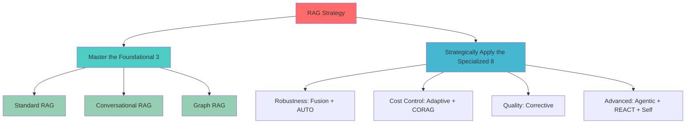

# 🎯 The RAG Reality Check: Separating Essential Foundations from Academic Explorations

> **TL;DR**: Out of 25 documented RAG variants, only ~11 solve 90% of real-world problems. Focus on mastering the essentials before exploring the exotic.

---

## 📊 Executive Summary

The world of Retrieval-Augmented Generation (RAG) is exploding, and with it, a torrent of new terminology. Our analysis of 25 documented RAG variations reveals a critical truth: while innovation is rampant, **the vast majority of successful, real-world enterprise needs—upwards of 90%—can be solved by mastering a small set of core, robust architectures**. The rest are fascinating specialized, niche, or academic concepts.

For practitioners, this complexity can be overwhelming. **The key is to simplify.** This article cuts through the noise, breaking down the 25 RAG types into three practical tiers, proving that a pragmatic, focused approach is the shortest path to production success.

---

## 🏛️ I. Essential Foundations: The Must-Haves (The Top 3)

> **These are the non-negotiable building blocks. Your RAG strategy must start here. They solve the most common, foundational business problems.**

| RAG Type | Real-World Necessity | Core Function | Typical Use Cases |
|----------|---------------------|---------------|-------------------|
| **1. Standard RAG** | 🟢 Universal Foundation | Simple, direct retrieval and answer generation | Document Q&A, Basic Chatbots, Initial Proof-of-Concepts (PoCs) |
| **2. Conversational RAG (CORAL)** | 🟢 Modern Necessity | Maintains context and memory across multi-turn dialogues | Virtual Assistants, High-fidelity Customer Service, Multi-step Troubleshooters |
| **3. Graph RAG** | 🟢 Enterprise Critical | Reasons over structured relationships and entities, not just flat text | Enterprise Knowledge Management, Regulatory Compliance, Financial Modeling, Complex Data Analysis |

### 💡 **The Takeaway**
- **No serious LLM application** should be built without mastering the retrieval mechanisms in **Standard RAG**
- Any system that engages users in a back-and-forth dialogue **must implement Conversational RAG**
- For complex data where relationships matter more than words (like org charts or interconnected systems), **Graph RAG is indispensable**

---

## 🚀 II. High-Value Specializations: The Critical 8 (When Constraints Arise)

> **These are not required for every project, but they become critical when production constraints—like cost, performance, and complexity—are introduced. They directly address the weaknesses of the foundational methods.**

### 🛡️ **For Robustness and Efficiency:**

#### **4. Fusion RAG**
- **Why**: Essential for robustness. It combines multiple retrieval methods (e.g., keyword search and vector search) to ensure higher recall and reliability
- **When to use**: When single-method retrieval is too brittle

#### **5. AUTO RAG**
- **Why**: Critical for production efficiency. It automates the optimization of the RAG pipeline (chunking size, embedding model selection, etc.)
- **When to use**: When you need to scale and maintain peak performance

### 💰 **For Cost and Quality Control:**

#### **6. Adaptive RAG & 7. CORAG (Cost-Constrained)**
- **Why**: Two sides of the same coin. They dynamically decide when to retrieve, what to retrieve, or if to skip the LLM call entirely to save cost and latency
- **When to use**: When cost or latency is a primary operational metric

#### **8. Corrective RAG**
- **Why**: Focuses on quality improvement by adding a validation loop to check the answer against the retrieved context for hallucinations
- **When to use**: In high-stakes, accuracy-critical domains (legal, medical)

### 🤖 **For Advanced Tool Use and Reasoning:**

#### **9. Agentic RAG & 10. REACT**
- **Why**: The future direction of RAG. They empower the LLM to reason, plan, and use external tools (like databases, code interpreters, or APIs) before answering
- **When to use**: For multi-step tasks that require planning and action

#### **11. Self RAG**
- **Why**: Improves output quality by asking the LLM to self-critique its generated answer and retrieve new information if needed
- **When to use**: When internal validation is necessary

---

## 🔬 III. Research & Niche Explorations: The "Nice-to-Know" (The Other 13)

> **The remaining RAG variants, while academically fascinating, address highly specific problems or represent foundational research ideas that have been largely absorbed into the 'Advanced RAG' umbrella. Trying to implement these directly often leads to unnecessary complexity and technical debt.**

### 📚 **Academic Foundations (REALM, RETRO)**
These were key research breakthroughs that paved the way for modern RAG:
- **REALM** (Retrieval-Augmented Language Model) was the original concept
- **RETRO** (Retrieval-Enhanced Transformer) explored memory-efficient scaling

**Reality**: They are rarely implemented as-is commercially today; their core ideas are integrated into modern techniques.

### 🎯 **Hyper-Specialized Applications (RAPTOR, CRAT, EACO-RAG)**

| RAG Type | Specific Use Case | Why It's Niche |
|----------|-------------------|-----------------|
| **RAPTOR** | Multi-level, hierarchical document summarization | Limited to large legal codes, academic papers |
| **CRAT** | Translation enhancement | Purely translation-specific |
| **EACO-RAG** | Edge computing optimization | Limited to mobile, IoT deployments |

### ⚠️ **The Risk of Over-Engineering**
The primary danger with these niche variants is attempting to retrofit them onto a generic problem. **The performance gain rarely justifies the complexity, maintenance overhead, and steep learning curve for development teams.**

---

## 💡 IV. Conclusion: Focus Your Efforts

### 🎯 **The "RAG Reality Check" is simple:**
**The solution to better performance is not always a new, complicated RAG type. It's often better implementation of the basics.**

### 🛠️ **To build an impactful, scalable RAG system, your focus should be on this core 11-architecture toolkit:**

### 📋 **Action Plan:**

1. **🎯 Master the Foundational 3**: Standard, Conversational, and Graph RAG
2. **🚀 Strategically Apply the Specialized 8**: Introduce techniques like Fusion RAG (for recall), Adaptive/CORAG (for cost), and Agentic RAG (for complexity) only when a specific, verifiable production constraint demands it

### 🏆 **The Bottom Line**
By prioritizing this pragmatic approach, practitioners can achieve **high-quality, production-ready AI applications** without being overwhelmed by the academic noise.

---

*"Perfect is the enemy of good. Master the fundamentals, then specialize strategically."*